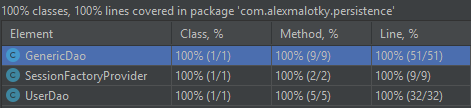
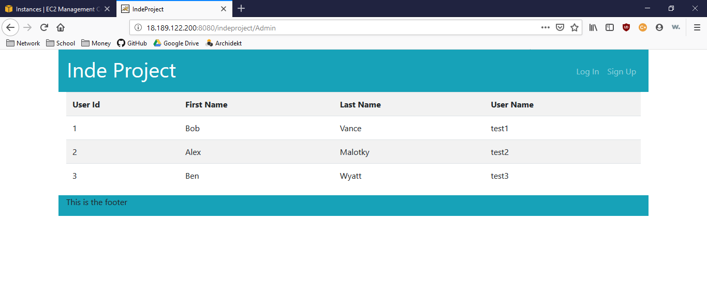

# Alex Malotky Individual Project
# _Weekly Meal Planning App_

## Problem Statement

Have you ever tried to plan out dinner for the week and then tried to go grocery shopping, only to forget something.
With this app you can save recipes, plan out meals, and create shopping lists for the week.

## Design
[User Stories](docs/useStories.md)    
[Screen Designs](docs/screens.md)  
[Project Flow](docs/flow.md)  
[Project Plan](docs/plan.md)

### Weekly Logs
[Time Log](timelog.md)  
[Weekly Journal](docs/reflection.md)

### Code Coverage

### AWS

### [Ginger Bread Men](https://www.allrecipes.com/recipe/9329/gingerbread-men/?internalSource=streams&referringId=841&referringContentType=Recipe%20Hub&clickId=st_trending_b)